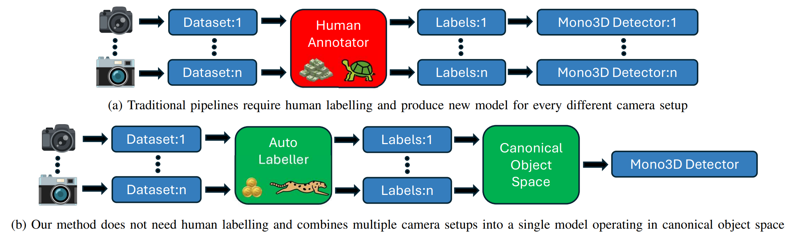

<!-- PROJECT SHIELDS -->
[![Contributors][contributors-shield]][contributors-url]
[![Forks][forks-shield]][forks-url]
[![Stargazers][stars-shield]][stars-url]
[![Issues][issues-shield]][issues-url]
[![MIT License][license-shield]][license-url]

[![arXiv][arxiv-shield]][arxiv-url]

[license-url]: https://github.com/jskvrna/MonoSOWA/blob/master/LICENSE.txt

[arxiv-shield]: https://img.shields.io/badge/arXiv-2405.12345-b31b1b.svg
[arxiv-url]: https://arxiv.org/abs/2501.09481

# MonoSOWA

Official implementation of **MonoSOWA**: **S**calable m**o**nocular 3D Object detector **W**ithout human **A**nnotations.
<p align="center">
    
</p>
<p align="center">
    
</p>
<!-- TABLE OF CONTENTS -->
<details open>
    <summary>Table of Contents</summary>
    <ol>
        <li>
            <a href="#Abstract">Abstract</a>
        </li>
        <li>
            <a href="#getting-started">Getting Started</a>
            <ul>
                <li><a href="#prerequisites">Prerequisites</a></li>
                <li><a href="#installation">Installation</a></li>
            </ul>
        </li>
        <li>
            <a href="#usage">Usage</a>
            <ul>
                <li><a href="#pseudo-labelling-pipeline">Pseudo-labelling Pipeline</a></li>
                <li><a href="#monodetr-training">MonoDETR Training</a></li>
            </ul>
        </li>
        <li><a href="#roadmap">Roadmap</a></li>
        <li><a href="#contributing">Contributing</a></li>
        <li><a href="#license">License</a></li>
        <li><a href="#contact">Contact</a></li>
        <li><a href="#acknowledgments">Acknowledgments</a></li>
    </ol>
</details>

<!-- ABSTRACT -->
## Abstract

Inferring object 3D position and orientation from a single RGB camera is a foundational task in computer vision with many important applications. Traditionally, 3D object detection methods are trained in a fully-supervised setup, requiring LiDAR and vast amounts of human annotations, which are laborious, costly, and do not scale well with the ever-increasing amounts of data being captured.

We present a novel method to train a 3D object detector from a single RGB camera without domain-specific human annotations, making orders of magnitude more data available for training. The method uses newly proposed Local Object Motion Model to disentangle object movement source between subsequent frames, is approximately 700 times faster than previous work and compensates camera focal length differences to aggregate multiple datasets.

The method is evaluated on three public datasets, where despite using no human labels, it outperforms prior work by a significant margin. It also shows its versatility as a pre-training tool for fully-supervised training and shows that combining pseudo-labels from multiple datasets can achieve comparable accuracy to using human labels from a single dataset.

<!-- GETTING STARTED -->
## Getting Started

To get a local copy up and running, follow these simple steps.

### Prerequisites

We recommend creating two separate virtual environments: one for pseudo-labelling and another for MonoDETR, due to potential package conflicts.

Clone the repository:

```sh
git clone https://github.com/jskvrna/MonoSOWA.git
```

### Installation of Pseudo-Labelling Pipeline

1.  Create a virtual environment:
    ```sh
    python3 -m venv pseudo_labelling
    source pseudo_labelling/bin/activate
    ```
2.  Install dependencies from `requirements.txt`:
    ```sh
    cd MonoSOWA/pseudo_label_generator
    pip install wheel ninja
    pip install waymo-open-dataset-tf-2-11-0==1.6.1
    pip install torch==2.7.0 torchvision torchaudio --index-url https://download.pytorch.org/whl/cu128
    pip install -U xformers --index-url https://download.pytorch.org/whl/cu128
    pip install -r requirements.txt
    ```
3.  Install Detectron2:
    ```sh
    python -m pip install 'git+https://github.com/facebookresearch/detectron2.git'
    ```
4.  Build PyTorch3D from source (recommended):
    ```sh
    pip install "git+https://github.com/facebookresearch/pytorch3d.git"
    ```

### Installation of MonoDETR

This step is a bit more involved. MultiScaleDeformableAttention, required by MonoDETR, needs a PyTorch version lower than 2.0. We have tested it with PyTorch 1.13.1, which works well. Since MSDA is compiled, the CUDA toolkit (nvcc) version must match the version PyTorch was compiled with. This can make installation more challenging.

Note: Our Canonical Objects Space can be implemented in any off-the-shelf monocular detector.

1.  Create a virtual environment:
    ```sh
    deactivate
    cd ../../
    python3 -m venv monodetr
    source monodetr/bin/activate
    ```
2.  Install dependencies from `requirements.txt`:
    ```sh
    cd MonoSOWA/MonoDETR
    pip install -r requirements.txt
    ```
3.  Compile the deformable attention module:
    ```sh
    cd lib/models/monodetr/ops/
    bash make.sh

    cd ../../../..
    ```

<!-- USAGE EXAMPLES -->
## Usage

Our method fully supports both KITTI and KITTI-360 datasets.

MonoDETR expects input in the KITTI format. For this reason, we provide the script `k360_to_k.py`, which converts KITTI-360 with pseudo-labels to the MonoDETR KITTI format.

To use the Waymo Open Perception Dataset, we provide a script that converts it into KITTI-360 format. Only the front camera is supported, and labels are extracted only if present in the front camera. See `waymo_to_kitti_projected.py` for more details.

### Pseudo-Labelling Pipeline

**Dataset Preparation**

1. KITTI - https://www.cvlibs.net/datasets/kitti/
    
    a. Download the [3D Object Detection](https://www.cvlibs.net/datasets/kitti/eval_object.php?obj_benchmark=3d) data and the [Raw Data](https://www.cvlibs.net/datasets/kitti/raw_data.php) (complete sequences).

    b. Unpack the `object_detection` data to match the following directory structure:
    ```text
    object_detection/
    ├── training/
    │   ├── calib/
    │   ├── image_2/
    │   ├── image_3/
    │   ├── label_2/
    │   └── velodyne/
    └── testing/
        ├── calib/
        ├── image_2/
        ├── image_3/
        └── velodyne/
    ```

    c. Unpack the `raw_data` data to match the following directory structure:

    ```text
    raw_data/
    ├── 2011_09_26/
    │   ├── 2011_09_26_drive_0001_sync/
    │   │   ├── image_00/
    │   │   ├── image_01/
    │   │   ├── image_02/
    │   │   ├── image_03/
    │   │   ├── oxts/
    │   │   └── velodyne_points/
    │   ├── ...
    │   ├── calib_cam_to_cam.txt
    │   ├── calib_imu_to_velo.txt
    │   └── calib_velo_to_cam.txt
    ├── 2011_09_28/
    ├── 2011_09_29/
    ├── 2011_09_30/
    └── 2011_10_03/
    ```

2. KITTI-360 - https://www.cvlibs.net/datasets/kitti-360/

    a. Download the [Perspective Images for Train & Val](https://www.cvlibs.net/datasets/kitti-360/download.php), [Calibrations](https://www.cvlibs.net/datasets/kitti-360/download.php), and [Vehicle Poses](https://www.cvlibs.net/datasets/kitti-360/download.php).

    b. Unpack the `Perspective Images for Train & Val`, `Calibrations`, and `Vehicle Poses` as follows:

    ```text
    KITTI-360/
    ├── 2013_05_28_drive_0000_sync/
    │   ├── image_00/
    │   └── image_01/
    ├── 2013_05_28_drive_0002_sync/
    ├── 2013_05_28_drive_0003_sync/
    ├── 2013_05_28_drive_0004_sync/
    ├── 2013_05_28_drive_0005_sync/
    ├── 2013_05_28_drive_0006_sync/
    ├── 2013_05_28_drive_0007_sync/
    ├── 2013_05_28_drive_0009_sync/
    ├── 2013_05_28_drive_0010_sync/
    ├── calibration/
    └── data_poses/
    ```

**Pseudo-Label Creator**

1. Update `pseudo_label_generator/3d/configs/config.yaml`. Most importantly:
    ```text
    kitti_path: path to object_detection
    all_dataset_path: path to either KITTI raw_data or the KITTI-360 folder
    detectron_config: path to the mvitv2 config
    merged_frames_path: path to the output folder for intermediate files
    labels_path: path to the output folder for final labels
    ```

2. Generate relative transformations between frames (CPU only):

    KITTI:
    ```sh 
    cd pseudo_label_generator/3d/scripts
    python main.py --config ../configs/config.yaml --dataset kitti --action transformations
    ```

    KITTI-360:
    ```sh 
    cd pseudo_label_generator/3d/scripts
    python main.py --config ../configs/config.yaml --dataset all --action transformations
    ```

3. Generate pseudo-lidar with Metric3Dv2 (GPU recommended):

    KITTI:
    ```sh 
    python main.py --config ../configs/config.yaml --dataset kitti --action lidar_scans
    ```

    KITTI-360:
    ```sh 
    python main.py --config ../configs/config.yaml --dataset all --action lidar_scans
    ```
    
    In case of having problems with Metric3D not finding giant backbone please refer to: https://github.com/YvanYin/Metric3D/issues/151.

4. Generate 2D masks via MViTv2 (GPU recommended):

    KITTI:
    ```sh 
    python main.py --config ../configs/config.yaml --dataset kitti --action mask_tracking
    ```

    KITTI-360:
    ```sh 
    python main.py --config ../configs/config.yaml --dataset all --action mask_tracking
    ```

5. Perform frame aggregation and optimization (CPU only, parallelization recommended):

    KITTI:
    ```sh 
    python main.py --config ../configs/config.yaml --dataset kitti --action optimization
    ```

    KITTI-360:
    ```sh 
    python main.py --config ../configs/config.yaml --dataset all --action optimization
    ```
### MonoDETR Training

We describe training for the KITTI dataset, as preparing KITTI-360 data requires additional steps (MonoDETR only supports KITTI format). Feel free to contact us if you need assistance.

**Dataset Preparation**

1. Copy the `object_detection` part of the KITTI dataset and ImageSets into `MonoDETR/data/KITTI/` with the official labels, using the following structure:

    ```text
    MonoDETR/data/KITTI/
    ├── ImageSets/
    │   ├── train.txt
    │   └── test.txt
    ├── training/
    │   ├── calib/
    │   ├── image_2/
    │   ├── image_3/
    │   └── velodyne/
    └── testing/
        ├── calib/
        ├── image_2/
        ├── image_3/
        └── velodyne/
    ```

2. Use replace human ground-truth training samples with pseudo-label ones, but keep the validation one. Also prepare the labels for training.
    ```sh
    cd pseudo_label_generator/
    python label_replacer.py MonoDETR/data/KITTI path_to_pseudo_labels
    python label_preparation.py MonoDETR/data/KITTI
    ```


**Model training**

To train the model, use the following command:
```sh
python tools/train_val.py --config configs/monodetr.yaml
```

**Evaluation**

To evaluate a trained model:
```sh
python tools/train_val.py --config configs/monodetr.yaml
```

<!-- ROADMAP -->
## Roadmap

-   [ ] Remove unnecessary files
-   [ ] Remove unnecessary packages
-   [ ] Release all pre-trained models

<!-- CONTRIBUTING -->
## Contributing

Contributions are what make the open source community such an amazing place to learn, inspire, and create. Any contributions you make are **greatly appreciated**.

If you have a suggestion that would make this better, please fork the repo and create a pull request. You can also simply open an issue with the tag "enhancement".
Don't forget to give the project a star! Thanks again!

1.  Fork the Project
2.  Create your Feature Branch (`git checkout -b feature/AmazingFeature`)
3.  Commit your Changes (`git commit -m 'Add some AmazingFeature'`)
4.  Push to the Branch (`git push origin feature/AmazingFeature`)
5.  Open a Pull Request

<!-- LICENSE -->
## License

Distributed under the MIT License. See `LICENSE.txt` for more information.

<!-- CONTACT -->
## Contact

Jan Skvrna - [jskvrna.github.io](https://jskvrna.github.io/) - skvrnjan@fel.cvut.cz

Czech Technical University in Prague - [Visual Recognition Group](https://vrg.fel.cvut.cz/)

Project Link: [https://github.com/jskvrna/MonoSOWA](https://github.com/jskvrna/MonoSOWA)

<!-- ACKNOWLEDGMENTS -->
## Acknowledgments

We would like to thank [MonoDETR](https://github.com/ZrrSkywalker/MonoDETR) for their high-quality code and method. Also [Metric3Dv2](https://github.com/YvanYin/Metric3D) and [MViTv2](https://github.com/facebookresearch/mvit) are highly ackwnoledged.

The research was supported by Czech Science Foundation Grant No. 24-10738M. The access to the computational infrastructure of the OP VVV funded project CZ.02.1.01/0.0/0.0/16\_019/0000765 ``Research Center for Informatics'' is also gratefully acknowledged. We also acknowledge the support from the Student Grant Competition of the Czech Technical University in Prague, grant No. SGS23/173/OHK3/3T/13.

## Citation

```bibtex
@article{skvrna2025monosowa,
    title={MonoSOWA: Scalable monocular 3D Object detector Without human Annotations},
    author={Skvrna, Jan and Neumann, Lukas},
    journal={arXiv preprint arXiv:2501.09481},
    year={2025}
}
```

<!-- MARKDOWN LINKS & IMAGES -->
<!-- https://www.markdownguide.org/basic-syntax/#reference-style-links -->
[contributors-shield]: https://img.shields.io/github/contributors/jskvrna/MonoSOWA.svg?style=for-the-badge
[contributors-url]: https://github.com/jskvrna/MonoSOWA/graphs/contributors
[forks-shield]: https://img.shields.io/github/forks/jskvrna/MonoSOWA.svg?style=for-the-badge
[forks-url]: https://github.com/jskvrna/MonoSOWA/network/members
[stars-shield]: https://img.shields.io/github/stars/jskvrna/MonoSOWA.svg?style=for-the-badge
[stars-url]: https://github.com/jskvrna/MonoSOWA/stargazers
[issues-shield]: https://img.shields.io/github/issues/jskvrna/MonoSOWA.svg?style=for-the-badge
[issues-url]: https://github.com/jskvrna/MonoSOWA/issues
[license-shield]: https://img.shields.io/github/license/jskvrna/MonoSOWA.svg?style=for-the-badge
[license-url]: https://github.com/jskvrna/MonoSOWA/blob/master/LICENSE.txt
[product-screenshot]: images/screenshot.png
[PyTorch.org]: https://img.shields.io/badge/PyTorch-EE4C2C?style=for-the-badge&logo=pytorch&logoColor=white
[PyTorch-url]: https://pytorch.org/
[NumPy.org]: https://img.shields.io/badge/numpy-%23013243.svg?style=for-the-badge&logo=numpy&logoColor=white
[NumPy-url]: https://numpy.org/
[OpenCV.org]: https://img.shields.io/badge/opencv-%235C3EE8.svg?style=for-the-badge&logo=opencv&logoColor=white
[OpenCV-url]: https://opencv.org/
